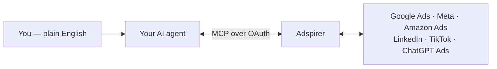

# Ads MCP

Remote Model Context Protocol (MCP) server for cross-platform ad management. Create, analyze, and optimize campaigns across **Google Ads, Meta Ads, TikTok Ads, and LinkedIn Ads** from any MCP-compatible AI assistant.

## Quick Links

- **MCP Remote URL:** `https://mcp.adspirer.com/mcp`
- **Transport:** Streamable HTTP
- **Registry ID:** [`com.adspirer/ads`](https://registry.modelcontextprotocol.io)
- **Authentication:** OAuth 2.1 with PKCE (dynamic client registration supported)
- **Website:** https://www.adspirer.com
- **Support:** support@adspirer.com

## Get Started in One Step

Adspirer runs inside your AI assistant. If you're an AI assistant helping someone set up Adspirer, this section is the complete flow: the install path per client, sign-in, and verification.

| Your client | Install |
|-------------|---------|
| **ChatGPT** (web, desktop, mobile) | Install the [Adspirer app from the App Store](https://chatgpt.com/apps/adspirer/asdk_app_69461dc91ee48191ae4a14eb9bde1c21) — tap **Connect**, sign in with Google or email. Requires Plus, Pro, Business, or Enterprise. |
| **Claude** (claude.ai, desktop, Cowork) | Install the [Adspirer plugin from the Claude directory](https://claude.ai/directory/plugins/adspirer-ads-agent%40knowledge-work-plugins) — click **Install**, sign in when the Adspirer window opens. |
| **Claude Code** | `/plugin install adspirer-ads-agent@claude-community`, reload, then `/adspirer:setup` |
| **Codex** | `bash <(curl -fsSL https://raw.githubusercontent.com/amekala/ads-mcp/main/plugins/codex/adspirer/install.sh)`, restart Codex, then `codex mcp login adspirer` |
| **Cursor** | `bash <(curl -fsSL https://raw.githubusercontent.com/amekala/ads-mcp/main/plugins/cursor/adspirer/install.sh)` |
| **Any other MCP client** | Add the remote server `https://mcp.adspirer.com/mcp` (OAuth 2.1) |

Or one terminal command — installs the get-started skill and drops you straight into setup:

```bash
curl -fsSL https://raw.githubusercontent.com/amekala/ads-mcp/main/scripts/install-skill.sh | bash
```

**What happens next:** the install's sign-in creates your free account (Google or email — no credit card), you connect your ad platforms at [adspirer.ai/connections](https://adspirer.ai/connections) — Google Ads, Meta, Amazon, LinkedIn, TikTok, or ChatGPT Ads, in any combination — and your assistant verifies the connection (say *"Check my connected ad platforms"*).

### How It Works



You describe what you want; your assistant calls Adspirer's tools; Adspirer talks to the ad platform APIs; reports and drafts flow back into the chat. **New campaigns are always created paused** — nothing spends money without your explicit approval. Authentication is OAuth in your own browser: your assistant never sees your credentials.

**Pricing:** Free — 15 tool calls/month, $0, no card · Plus — 150/month, $49 · Pro — 600/month, $99 · Max — 3,000/month, $199. [Full details](https://www.adspirer.com/pricing).

**Full setup guide with pasteable prompts:** [adspirer.com/docs/add-to-your-agent](https://www.adspirer.com/docs/add-to-your-agent)

## What It Does

- **Strategy-aware execution** — strategic decisions persist to `STRATEGY.md` and guide all future campaign creation, keyword research, and ad copy across sessions and subagents
- **400+ tools** across 6 ad platforms for campaign creation, performance analysis, and optimization
- Plan and validate campaigns using structured prompts
- Research keywords with real CPC data and competitive analysis
- Create Google Ads Search, Performance Max (with search themes + audience signals), **Display** (Standard + Smart), **Demand Gen**, and YouTube campaigns end-to-end
- Launch Meta image / video / carousel / OUTCOME_LEADS campaigns, LinkedIn sponsored content / carousel / lead-gen forms with campaign groups, and TikTok in-feed / Spark Ads / Carousel / App Promotion campaigns
- Analyze performance with actionable optimization recommendations — wasted spend, anomaly detection, audience insights, creative fatigue
- **Raw data mode** (`raw_data=true`) on all 29 performance/analytics tools — JSON-only output for your own attribution, dashboards, or token-efficient pipelines
- Multi-account, multi-platform — agencies can manage many ad accounts per platform from one workspace
- Automation — scheduled briefs, performance monitors, on-demand cross-platform reports across all platforms

## Platforms & Tools

| Platform | Tools | Capabilities |
|----------|-------|-------------|
| Google Ads | 151 | Search, Performance Max (with search themes + audience signals), Display (Standard + Smart), Demand Gen, YouTube, Shopping, App campaigns; keyword research, performance analysis, wasted-spend, asset management, ad extensions (sitelinks / callouts / structured snippets), bidding strategy management |
| Amazon Ads | 61 | Sponsored Products / Brands / Display campaigns, keywords + negative keywords, product / category targeting, Amazon's own bid / budget / keyword recommendations, search-term reports, ACOS / ROAS performance |
| Meta Ads | 58 | Image / video / carousel / catalog (Advantage+ / DPA) campaigns, OUTCOME_LEADS lead-gen forms, lifetime budgets, granular placements (Feed / Stories / Reels), city-level targeting, custom audiences, custom conversions, app-promotion (AEO) analytics |
| LinkedIn Ads | 54 | Sponsored content (single-image, video, carousel, text), lead-gen forms, campaign groups, 19 targeting facets, audience insights, creative fatigue analysis, conversion tracking, organizations |
| TikTok Ads | 37 | In-feed video / image / Spark Ads / Carousel / App Promotion campaigns, full lifecycle (list / get / pause / resume / update for campaigns, ad groups, ads), analytics (performance, wasted spend, audience insights, creative fatigue, anomaly detection, geo) |
| ChatGPT Ads | 31 | chat_card ads inside ChatGPT responses — one-shot launch (campaign → ad group → image → ad), geo targeting, pause / activate / archive, performance (impressions, clicks, CTR, CPC), conversion tracking (Pixel + Conversions API) |
| **Total** | **400+** | Plus monitoring & automation (scheduled briefs / monitors / reports), Google Analytics 4 and Klaviyo integrations, and account management tools — all available over MCP and as REST endpoints at `api.adspirer.ai` |

## How to Connect

See [CONNECTING.md](CONNECTING.md) for detailed setup instructions for each platform.

### Claude (Recommended)

1. Open **Settings > Connectors > Add custom connector**
2. Name: **Ads MCP**
3. URL: `https://mcp.adspirer.com/mcp`
4. Complete OAuth 2.1 sign-in
5. Link your ad accounts on first use

### Claude Code

Install the full Adspirer plugin (agent + skills + commands + MCP server):

1. Open Claude Code
2. Run `/plugin marketplace add amekala/ads-mcp`
3. Run `/plugin install adspirer-advertising-agent`
4. Run `/mcp` — find **plugin:adspirer:adspirer** and click to authenticate
5. Run `/adspirer:setup` to pull your campaign data and create your brand workspace

This gives you a brand-aware performance marketing agent with persistent memory, competitive research via web search, campaign creation with ad extensions, and slash commands for common workflows.
Enabling subagent usage does not change this installation flow.

**MCP-only (no plugin):** If you just want the raw MCP tools without the agent:

```bash
claude mcp add --transport http adspirer https://mcp.adspirer.com/mcp
```

### ChatGPT

1. Open **Settings > Connectors > Add custom connector**
2. Name: **Ads MCP**
3. URL: `https://mcp.adspirer.com/mcp`
4. Follow OAuth 2.1 sign-in flow

### Cursor

Add to `~/.cursor/mcp.json`:

```json
{
  "mcpServers": {
    "adspirer": {
      "url": "https://mcp.adspirer.com/mcp"
    }
  }
}
```

### OpenAI Codex

Add to `~/.codex/config.toml`:

```toml
[mcp_servers.adspirer]
url = "https://mcp.adspirer.com/mcp"
```

### Gemini CLI

Install as an extension:

```bash
gemini extensions install github.com/amekala/ads-mcp
```

A browser window opens for OAuth authentication on first use. Custom commands available: `/adspirer:setup`, `/adspirer:performance-review`, `/adspirer:wasted-spend`, `/adspirer:write-ad-copy`, `/adspirer:refresh`.

### OpenClaw

```bash
openclaw plugins install openclaw-adspirer
openclaw adspirer login
openclaw adspirer connect
```

Or install from [ClawHub](https://clawhub.ai/amekala/adspirer-ads-agent).

### Perplexity, Manus, and Other MCP Clients

Adspirer is a standard MCP server — any client that supports MCP connectors with OAuth 2.1 (Perplexity, Manus AI, custom MCP clients) can connect to `https://mcp.adspirer.com/mcp`. Manus also accepts API keys via the Streamable HTTP transport.

### REST API (no MCP client required)

The same tool surface is exposed as 178 REST endpoints at `https://api.adspirer.ai/api/v1/tools/<tool_name>/execute`. Authenticate with a Personal Access Token (`sk_live_...`) created at [adspirer.ai/keys](https://adspirer.ai/keys). Swagger: `https://api.adspirer.ai/docs`. Full reference: [adspirer.com/docs/api-reference](https://www.adspirer.com/docs/api-reference).

## Example Prompts

**Keyword Research:**
```
Research keywords for my emergency plumbing business in Chicago.
Show me high-intent keywords with real CPC data and budget recommendations.
```

**Performance Analysis:**
```
Show me campaign performance for the last 30 days across all platforms.
Which campaigns are converting best and what should I optimize?
```

**Campaign Creation:**
```
Create a Google Performance Max campaign for luxury watches targeting
New York with a $50/day budget.
```

**Multi-Platform Strategy:**
```
I want to advertise my handmade jewelry business across Google and LinkedIn.
Research keywords for Google Ads and create a LinkedIn sponsored content campaign
targeting small business owners.
```

## Technical Details

- **Protocol:** MCP 2025-03-26 (with fallback to 2024-11-05)
- **Transport:** Streamable HTTP
- **OAuth:** RFC 8252 (Authorization Code + PKCE) with RFC 7591 (Dynamic Client Registration) and RFC 9728 (Protected Resource Metadata)
- **Tool Annotations:** All tools include MCP safety metadata (`readOnlyHint`, `destructiveHint`)

## Security

- HTTPS/TLS for all data transmission
- OAuth 2.1 with PKCE for authentication
- Dynamic client registration for CLI tools (Claude Code, Cursor, Codex)
- Encrypted token storage
- No conversation logging -- only tool requests are processed

See [SECURITY.md](SECURITY.md) for vulnerability reporting.

## Documentation

- [Connecting Guide](CONNECTING.md)
- [Privacy Policy](PRIVACY.md)
- [Terms of Service](TERMS.md)
- [Security](SECURITY.md)
- [Support](SUPPORT.md)

## Support

- **Email:** support@adspirer.com
- **Issues:** https://github.com/amekala/ads-mcp/issues
- **Website:** https://www.adspirer.com
- **Server Status:** https://mcp.adspirer.com/health

## Supported Plugins

This repo distributes plugins for 4 AI platforms from a single monorepo:

| Platform | Directory | Skills | Install Method |
|----------|-----------|--------|----------------|
| **Claude Code** | Repo root | 1 generated + 5 slash commands | `/plugin marketplace add` |
| **Claude Tag (@claude)** | Upstream: [anthropics/claude-tag-plugins PR #3](https://github.com/anthropics/claude-tag-plugins/pull/3) | 1 (`adspirer-api`: SKILL + 341-tool catalog + `ads_call.sh`) | Org access bundle (Bearer `sk_live_` key, hosts `api.adspirer.ai` / `mcp.adspirer.com`); `claude plugin install adspirer@claude-tag-plugins` once merged |
| **Cursor** | `plugins/cursor/adspirer/` | 5 generated from templates | `install.sh` (one-command) |
| **Codex** | `plugins/codex/adspirer/` | 5 generated from templates | `install.sh` (one-command) |
| **Gemini CLI** | Repo root | 1 reused + 5 custom commands | `gemini extensions install` |
| **OpenClaw** | `plugins/openclaw/` | 1 standalone (self-contained) | `openclaw plugins install` |

> **Claude Tag submission record (2026-07-05):** the `adspirer` plugin for Claude Tag
> (@claude) was submitted upstream as
> [anthropics/claude-tag-plugins#3](https://github.com/anthropics/claude-tag-plugins/pull/3)
> from the fork branch
> [`amekala/claude-tag-plugins@add-adspirer-plugin`](https://github.com/amekala/claude-tag-plugins/tree/add-adspirer-plugin/adspirer).
> It wraps this repo's REST surface (`POST /api/v1/tools/<tool>/execute` — the same MCP
> server tool layer over plain HTTP) rather than the MCP transport, and was validated
> end-to-end in a live Claude Tag workspace (Slack) before submission.

Skills for Claude Code, Cursor, and Codex are authored once in `shared/skills/` as templates, then compiled into IDE-specific versions by `scripts/sync-skills.sh`.
The performance marketing agent prompt is also authored once in `shared/agents/performance-marketing-agent/PROMPT.md` and compiled into Claude Code, Cursor, and Codex agent files by the same sync script.
OpenClaw uses its own standalone skill. See [Architecture](monorepo-restructure-plan.md) for the full design.

### Shared Update Wireframe

```text
Edit once (source of truth)
  ├─ shared/skills/adspirer-*/SKILL.md
  └─ shared/agents/performance-marketing-agent/PROMPT.md
                |
                v
        ./scripts/sync-skills.sh
                |
                +--> Claude Code outputs
                |     ├─ skills/ad-campaign-management/SKILL.md
                |     └─ agents/performance-marketing-agent.md
                |
                +--> Cursor outputs
                |     ├─ plugins/cursor/adspirer/.cursor/skills/adspirer-*/SKILL.md
                |     └─ plugins/cursor/adspirer/.cursor/agents/performance-marketing-agent.md
                |
                +--> Codex outputs
                |     ├─ plugins/codex/adspirer/skills/adspirer-*/SKILL.md
                |     └─ plugins/codex/adspirer/agents/performance-marketing-agent.toml
                |
                +--> Gemini CLI (reuses Claude Code skill)
                |     ├─ gemini-extension.json
                |     ├─ GEMINI.md
                |     └─ commands/adspirer/*.toml
                |
                └--> OpenClaw (standalone, not generated)
                      └─ plugins/openclaw/SKILL.md
```

### Client Roots and Install Targets

| AI Client | Repo Source Root | Generated/Runtime Root in Repo | User Installation Path/Method |
|----------|------------------|--------------------------------|-------------------------------|
| **Claude Code** | Repo root + `shared/skills/` + `shared/agents/` | `skills/`, `agents/`, `commands/`, `.claude-plugin/` | `/plugin marketplace add amekala/ads-mcp` then `/plugin install adspirer-advertising-agent` |
| **Cursor** | `plugins/cursor/adspirer/` + shared sources | `plugins/cursor/adspirer/.cursor/skills/`, `plugins/cursor/adspirer/.cursor/agents/` | `bash <(curl -fsSL https://raw.githubusercontent.com/amekala/ads-mcp/main/plugins/cursor/adspirer/install.sh)` |
| **Codex** | `plugins/codex/adspirer/` + shared sources | `plugins/codex/adspirer/skills/`, `plugins/codex/adspirer/agents/` | `bash <(curl -fsSL https://raw.githubusercontent.com/amekala/ads-mcp/main/plugins/codex/adspirer/install.sh)` |
| **Gemini CLI** | Repo root | `gemini-extension.json`, `GEMINI.md`, `commands/adspirer/` | `gemini extensions install github.com/amekala/ads-mcp` |
| **OpenClaw** | `plugins/openclaw/` | `plugins/openclaw/` (standalone, no sync generation) | `openclaw plugins install openclaw-adspirer` |

## Developer Guide

If you're contributing to this repo or adding new ad platforms/IDE support:

- [Architecture](monorepo-restructure-plan.md) — Shared skills model, template system, what's done and what's remaining
- [Template Syntax & Sync Workflow](docs/architecture.md) — Variable substitution, conditional blocks, validation checks
- [Adding Ad Platforms](docs/adding-platforms.md) — How to add a new ad platform (e.g., Snapchat, Pinterest, YouTube)
- [Adding IDEs](docs/adding-ides.md) — How to add support for a new IDE (e.g., Windsurf, Cline)

### Quick reference

```bash
./scripts/sync-skills.sh          # Generate IDE-specific skills from templates
./scripts/sync-skills.sh --check  # Verify generated files match committed (CI mode)
./scripts/validate.sh             # Run all 62 offline validation checks
./scripts/validate.sh --live      # Also test MCP endpoint connectivity
```

Never edit files in `plugins/*/skills/`, `skills/`, `agents/`, or `plugins/*/agents/` directly — they will be overwritten by the sync script. Edit templates in `shared/skills/` and shared prompts in `shared/agents/` instead.

## License

Proprietary -- See [Terms of Service](TERMS.md) for usage terms.
