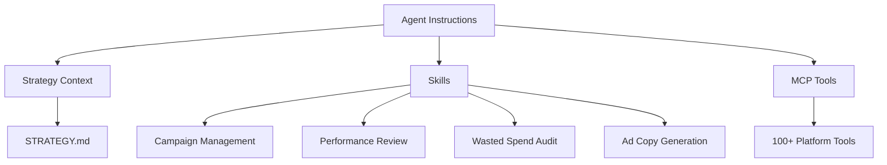

# Agent Architecture

Adspirer's agent framework goes beyond raw MCP tools. It provides a structured layer that makes AI assistants into capable performance marketing agents.

## Components

### Agent Instructions
Pre-built prompts that configure the AI as a performance marketing expert. Available for Claude Code, Cursor, Codex, and OpenClaw.

### Strategy Context
A persistent `STRATEGY.md` document that captures your brand positioning, target audience, competitive landscape, and campaign history. Every action the agent takes references this context.

### Skills
High-level workflows that combine multiple tools into guided processes. See the [Skills Overview](/mcp/skills/overview).

### MCP Tools
The 100+ individual tools for interacting with ad platforms. See platform-specific tool references:
- [Google Ads Tools](/mcp/platforms/google-ads)
- [Meta Ads Tools](/mcp/platforms/meta-ads)
- [LinkedIn Ads Tools](/mcp/platforms/linkedin-ads)
- [TikTok Ads Tools](/mcp/platforms/tiktok-ads)
