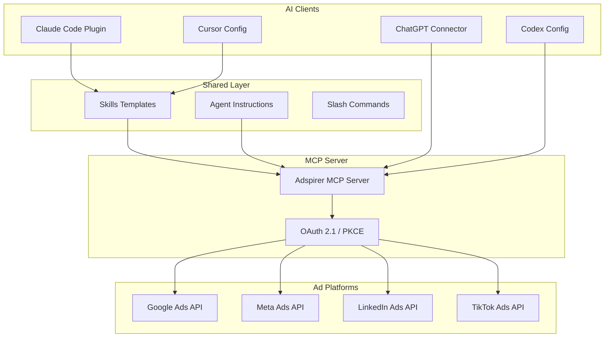

# Architecture

The Adspirer MCP server uses a shared-skills architecture for consistent behavior across all AI clients.

## System Overview

## Shared Skills

Skills are defined as Markdown templates in `shared/skills/`. Each skill contains:

- **SKILL.md** — The skill definition with instructions and workflow steps
- **references/** — Supporting documents and examples

Skills are the source of truth — IDE-specific plugins generate their implementations from these shared templates.

## Plugin System

Each IDE gets a tailored plugin that adapts the shared skills to its environment:

| IDE | Plugin Location | Adapts For |
|-----|----------------|------------|
| Claude Code | `plugins/claude-code/` | Slash commands, CLAUDE.md, subagents |
| Cursor | `plugins/cursor/` | .cursor/rules, MCP config |
| Codex | `plugins/codex/` | config.toml, agent instructions |
| OpenClaw | `plugins/openclaw/` | Plugin manifest, commands |

## Server Registry

The MCP server is registered at `registry.modelcontextprotocol.io` as `com.adspirer/ads`. The `server.json` file contains the registry manifest with server metadata, capabilities, and authentication requirements.
